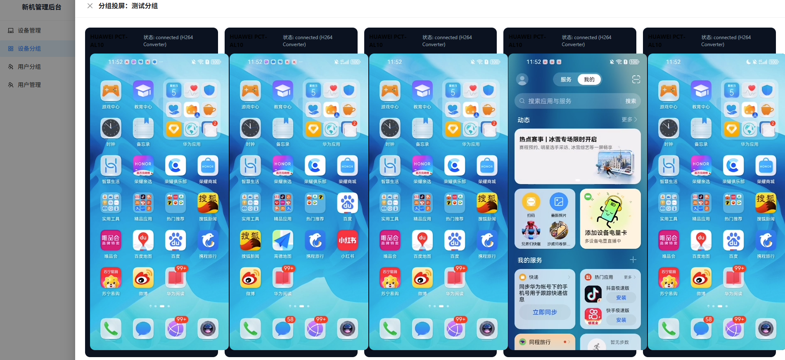
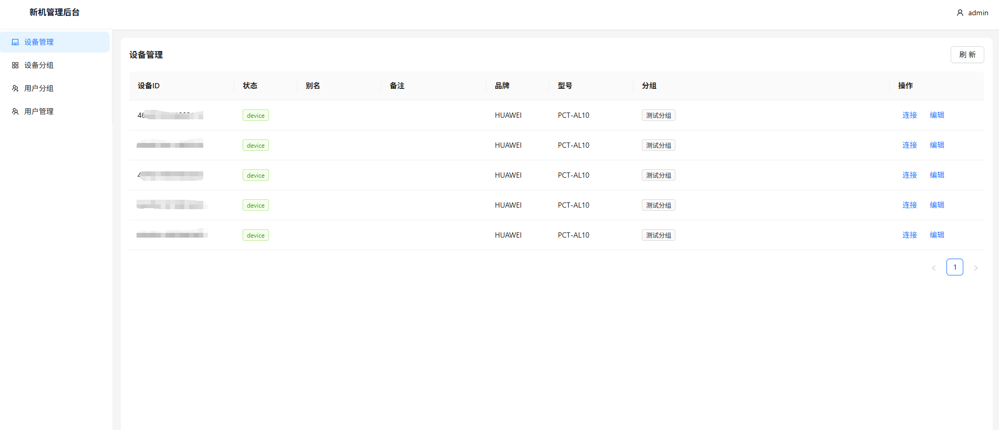
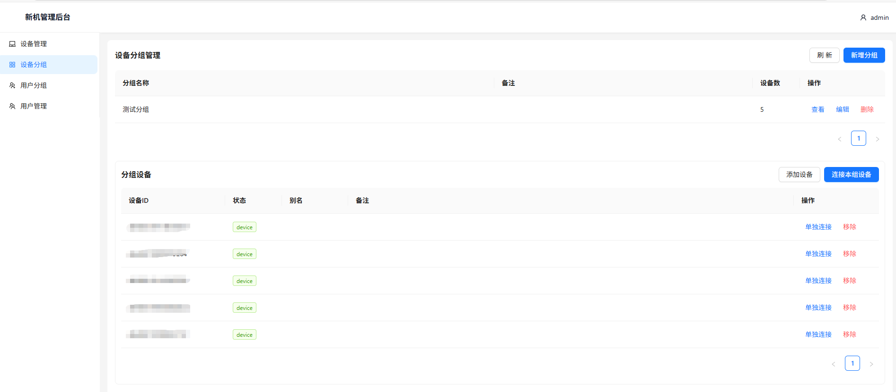
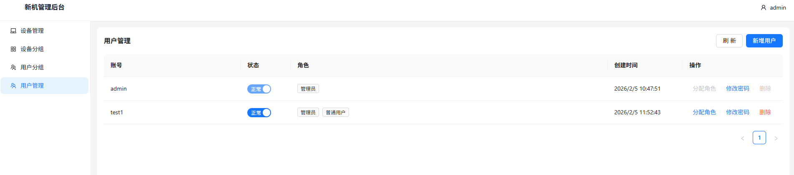
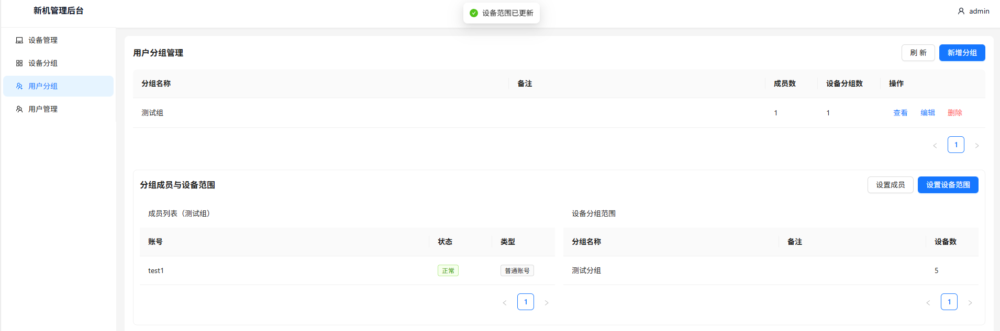

# controlPhoneDesk Admin Console (Java + React)

English | [中文](README.zh-CN.md)

A **local-first** Android device management console (Android-only). Manage **USB / TCP** connected devices from the browser, with screen casting and control.

## Acknowledgements

- scrcpy: https://github.com/Genymobile/scrcpy
- ws-scrcpy: https://github.com/NetrisTV/ws-scrcpy

## Statement

- Pure vibe coding project
- Tooling: codex-cli 0.94.0
- Model: gpt-5.2-codex (high)
- Skill: vercel-react-best-practices
  https://github.com/vercel-labs/agent-skills/tree/main/skills/react-best-practices

## Tech Stack

### Backend

- Java 21
- Spring Boot 4.0.2
- SQLite
- JWT authentication
- ADB / scrcpy

### Frontend (Web / H5)

- React
- Vite

## Features

- Remote Android device management (USB / TCP)
- Real-time screen casting and control based on scrcpy
- Dual clients: Web / H5
- Basic admin console and permission control
- RBAC model (API-level)

## Screenshots

Device screen:



Device management:



Device groups:



User management:



User groups:



## Structure

```text
controlPhoneDesk/
├─ backend/        # Spring Boot 4 backend (Java 21)
├─ frontend/       # Web admin (React + Vite)
├─ frontend-h5/    # H5 client (React + Vite)
└─ shared/         # Shared code
```

## Backend

```bash
cd backend
mvn spring-boot:run
```

Default port: `8080`

### Config (backend/src/main/resources/application.yml)

- `app.adb.bin`: adb executable path (default `adb`)
- `app.scrcpy.serverPort`: scrcpy server port (default `8886`)
- `spring.datasource.url`: SQLite db path (default `./data/app.db`)
- `app.security.jwt.secret`: JWT secret (replace in production)

## Frontend

Set API base in `frontend/.env` and `frontend-h5/.env`:

```env
VITE_API_BASE=http://localhost:8080
```

Web admin:

```bash
cd frontend
npm install
npm run dev
```

H5 client:

```bash
cd frontend-h5
npm install
npm run dev
```

Default ports:
- Web: `5173`
- H5: `5174`

## Usage

1. Make sure `adb devices` can detect your Android devices.
2. Open Web: http://localhost:5173
3. Open H5: http://localhost:5174
4. Login with default super admin: `admin / admin123`
5. Connect devices from Device/Group pages to cast and control.

## Notes

- RBAC model: user-role-permission, enforced per API.
- All APIs require JWT except login.
- Super admin has all permissions, bypassing RBAC restrictions.
- WebCodecs/MSE auto fallback: when accessed via IP in non-secure context, switches to MSE decoding.

## License

MIT
